# HardwareB2B Platform — Entity Relationship Diagram

```mermaid
erDiagram

    %% ─────────────────────────────────────────
    %%  CORE ENTITIES
    %% ─────────────────────────────────────────

    USERS {
        int         id              PK
        varchar     email           UK  "NOT NULL"
        varchar     password_hash       "NOT NULL"
        varchar     user_type           "shop | contractor | admin"
        varchar     company_name
        varchar     phone
        text        address
        varchar     tax_id
        boolean     verified            "DEFAULT false"
        timestamp   created_at          "DEFAULT NOW()"
        timestamp   deleted_at          "soft delete"
    }

    PRODUCTS {
        int         id              PK
        int         shop_id         FK  "→ users.id"
        varchar     name                "NOT NULL"
        text        description
        varchar     category
        decimal     unit_price
        decimal     bulk_price
        int         minimum_bulk_quantity
        int         stock_quantity
        varchar     unit_type
        varchar     pricing_method      "DEFAULT 'unit'"
        text[]      images
        varchar     sku
        varchar     brand
        text[]      tags
        timestamp   created_at          "DEFAULT NOW()"
    }

    REQUESTS {
        int         id              PK
        int         contractor_id   FK  "→ users.id"
        int         shop_id         FK  "→ users.id"
        timestamp   request_date        "DEFAULT NOW()"
        varchar     status              "pending|confirmed|shipped|delivered|cancelled"
        decimal     total_amount
        text        delivery_address
        date        delivery_date
        text        notes
        varchar     tracking_status     "DEFAULT 'awaiting_dispatch'"
        timestamp   dispatched_at
        timestamp   in_transit_at
        timestamp   delivered_at
        text        tracking_notes
        varchar     payment_status      "DEFAULT 'unpaid'"
        varchar     payment_intent_id
        int         cancelled_by    FK  "→ users.id"
    }

    REQUEST_ITEMS {
        int         id              PK
        int         request_id      FK  "→ requests.id"
        int         product_id      FK  "→ products.id"
        int         quantity
        decimal     unit_price
        decimal     subtotal
    }

    FAVORITES {
        int         id              PK
        int         user_id         FK  "→ users.id  ON DELETE CASCADE"
        int         product_id      FK  "→ products.id  ON DELETE CASCADE"
        timestamp   created_at          "DEFAULT NOW()"
    }

    REVIEWS {
        int         id              PK
        int         from_user_id    FK  "→ users.id"
        int         to_user_id      FK  "→ users.id"
        int         order_id        FK  "→ orders.id"
        int         rating              "CHECK 1–5"
        text        comment
        timestamp   created_at          "DEFAULT NOW()"
    }

    %% ─────────────────────────────────────────
    %%  TEMPLATES (Contractor bulk order templates)
    %% ─────────────────────────────────────────

    ORDER_TEMPLATES {
        int         id              PK
        int         user_id         FK  "→ users.id (contractor)"
        varchar     name
        timestamp   created_at          "DEFAULT NOW()"
    }

    TEMPLATE_ITEMS {
        int         id              PK
        int         template_id     FK  "→ order_templates.id"
        int         product_id      FK  "→ products.id"
        int         quantity
    }

    %% ─────────────────────────────────────────
    %%  AUDIT & SECURITY
    %% ─────────────────────────────────────────

    AUDIT_LOGS {
        int         id              PK
        int         user_id         FK  "→ users.id"
        varchar     action              "NOT NULL"
        varchar     entity_type
        int         entity_id
        inet        ip_address
        text        user_agent
        jsonb       details
        timestamp   created_at          "DEFAULT NOW()"
    }

    PASSWORD_RESET_TOKENS {
        int         id              PK
        int         user_id         FK  "→ users.id  ON DELETE CASCADE"
        varchar     token           UK  "NOT NULL"
        timestamp   expires_at          "NOT NULL"
        boolean     used                "DEFAULT false"
        timestamp   created_at          "DEFAULT NOW()"
    }

    %% ─────────────────────────────────────────
    %%  CHAT
    %% ─────────────────────────────────────────

    CHAT_MESSAGES {
        int         id              PK
        int         request_id      FK  "→ requests.id"
        int         sender_id       FK  "→ users.id"
        int         receiver_id     FK  "→ users.id"
        text        message
        boolean     is_read             "DEFAULT false"
        timestamp   created_at          "DEFAULT NOW()"
    }

    %% ─────────────────────────────────────────
    %%  ADMIN
    %% ─────────────────────────────────────────

    DISPUTES {
        int         id              PK
        int         reported_by     FK  "→ users.id"
        int         reported_against FK "→ users.id"
        int         request_id      FK  "→ requests.id"
        varchar     dispute_type        "DEFAULT 'general'"
        varchar     status              "open|investigating|resolved|dismissed"
        text        description         "NOT NULL"
        text        resolution_notes
        int         resolved_by     FK  "→ users.id (admin)"
        timestamp   resolved_at
        timestamp   created_at          "DEFAULT NOW()"
    }

    PLATFORM_SETTINGS {
        int         id              PK
        varchar     setting_key     UK
        text        setting_value
        text        description
        int         updated_by      FK  "→ users.id (admin)"
        timestamp   updated_at
    }

    %% ─────────────────────────────────────────
    %%  RELATIONSHIPS
    %% ─────────────────────────────────────────

    %% Shop owns products
    USERS ||--o{ PRODUCTS : "shop owns"

    %% Contractor places requests, shop receives requests
    USERS ||--o{ REQUESTS : "contractor places"
    USERS ||--o{ REQUESTS : "shop receives"

    %% Request contains items
    REQUESTS ||--|{ REQUEST_ITEMS : "contains"

    %% Request items reference products
    PRODUCTS ||--o{ REQUEST_ITEMS : "included in"

    %% Contractor saves favorites
    USERS ||--o{ FAVORITES : "contractor saves"
    PRODUCTS ||--o{ FAVORITES : "saved as"

    %% Reviews between users tied to a request
    USERS ||--o{ REVIEWS : "writes"
    USERS ||--o{ REVIEWS : "receives"
    REQUESTS ||--o{ REVIEWS : "reviewed via"

    %% Contractor creates order templates
    USERS ||--o{ ORDER_TEMPLATES : "contractor creates"
    ORDER_TEMPLATES ||--|{ TEMPLATE_ITEMS : "has"
    PRODUCTS ||--o{ TEMPLATE_ITEMS : "referenced in"

    %% Chat messages tied to a request
    REQUESTS ||--o{ CHAT_MESSAGES : "has chat"
    USERS ||--o{ CHAT_MESSAGES : "sends"
    USERS ||--o{ CHAT_MESSAGES : "receives"

    %% Disputes tied to requests and users
    REQUESTS ||--o{ DISPUTES : "disputed via"
    USERS ||--o{ DISPUTES : "reported by"
    USERS ||--o{ DISPUTES : "reported against"
    USERS ||--o{ DISPUTES : "resolved by (admin)"

    %% Platform settings managed by admin
    USERS ||--o{ PLATFORM_SETTINGS : "admin updates"

    %% Audit logs track user actions
    USERS ||--o{ AUDIT_LOGS : "actions tracked"

    %% Password reset tokens belong to users
    USERS ||--o{ PASSWORD_RESET_TOKENS : "requests reset"
```

---

## Table Summary

| Table | Role | Key Relationships |
|---|---|---|
| `users` | Shops, Contractors, Admins | Central entity — all others link back here |
| `products` | Shop's product catalogue | Owned by `users` (shop) |
| `requests` | Contractor purchase requests/orders | Links contractor + shop from `users` |
| `request_items` | Line items per request | Links `requests` ↔ `products` |
| `favorites` | Contractor saved products | Links `users` (contractor) ↔ `products` |
| `reviews` | Post-request ratings | Links two `users` via a `request` |
| `order_templates` | Contractor reusable order lists | Owned by `users` (contractor) |
| `template_items` | Items inside a template | Links `order_templates` ↔ `products` |
| `chat_messages` | Real-time request chat | Links `requests` + sender/receiver `users` |
| `disputes` | Admin-managed request disputes | Links `requests` + reporter/respondent `users` |
| `platform_settings` | Admin config key-value store | Updated by `users` (admin) |
| `audit_logs` | Admin activity trail | Tracks actions by `users` |
| `password_reset_tokens` | Password recovery tokens | Belongs to `users` |

---

## Key Constraints

| Constraint | Table | Detail |
|---|---|---|
| `UNIQUE(user_id, product_id)` | `favorites` | One favorite per product per user |
| `CHECK user_type IN (...)` | `users` | Only `shop`, `contractor`, `admin` |
| `CHECK rating BETWEEN 1 AND 5` | `reviews` | Star rating validation |
| `ON DELETE CASCADE` | `favorites` | Auto-removes when user or product deleted |
| `ON DELETE CASCADE` | `password_reset_tokens` | Tokens removed when user is deleted |
| `DEFAULT 'pending'` | `requests` | New requests start as pending |
| `DEFAULT 'awaiting_dispatch'` | `requests.tracking_status` | Initial tracking state |
| `DEFAULT 'unpaid'` | `requests.payment_status` | Initial payment state |
| `DEFAULT 'unit'` | `products.pricing_method` | Default pricing method |
| `DEFAULT false` | `users.verified` | All accounts unverified until admin approves |
| `UNIQUE token` | `password_reset_tokens` | One active token per reset request |
