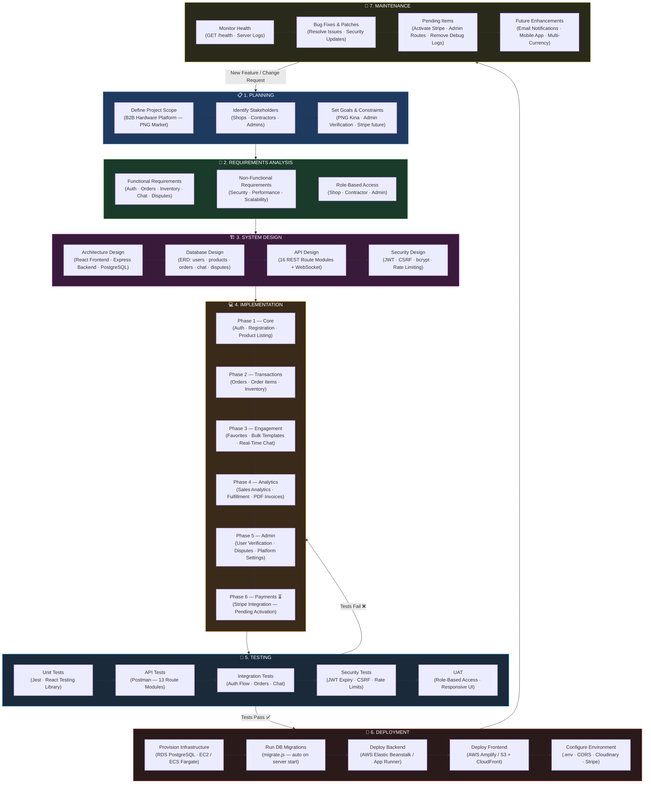
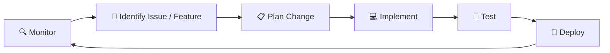

# Hardware B2B Platform — SDLC Diagram

---

## Phase Summary

| Phase | Key Activities | Status |
|---|---|---|
| 1. Planning | Scope, stakeholders, goals, constraints | ✅ Complete |
| 2. Requirements | Functional + non-functional, role-based access | ✅ Complete |
| 3. System Design | Architecture, ERD, API design, security | ✅ Complete |
| 4. Implementation | 6 development phases (Core → Payments) | 🔄 Phase 6 Pending |
| 5. Testing | Unit, API, integration, security, UAT | 🔄 In Progress |
| 6. Deployment | AWS infrastructure, migrations, CI/CD | ⏳ Upcoming |
| 7. Maintenance | Monitoring, bug fixes, enhancements | ⏳ Upcoming |

---

## Feedback Loop

